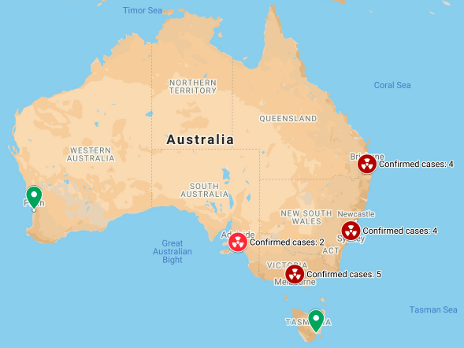
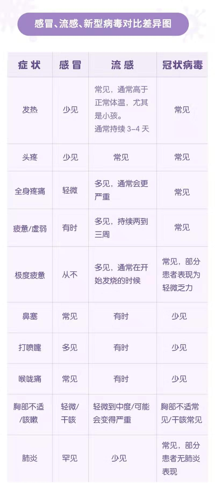

# 2019-nCoV-AU(澳大利亚-武汉新型肺炎疫情动态)

## 病例及分布

| 地区 |  首府| 确诊 | 死亡 |治愈 |
| ------------- |:-------------:| -----:|------------|--------------|
|澳洲   |全国 | 12 |0| 2|
|新南威尔士州（NSW） |悉尼（Sydney） | 4 |0| 0|
|维多利亚州（VIC）   |墨尔本(Melbourne) | 4 | 0 |0|
|昆士兰州（QLD）     | 布里斯班（Brisbane）|2 | 0 |0|
|西澳大利亚州（WA）    |珀斯（Perth）| 0 | 0 |0|
|南澳大利亚州（SA）    |阿德莱德（Adelaide）| 2 | 0 |0|
|塔斯马尼亚州（TAS）   |霍巴特（Hobart） |0 | 0 |0|
|北领地（NT）   |达尔文（Sydney） |0 | 0 |0|
|澳大利亚首都领地（ACT）  |堪培拉（Canberra）|0 | 0 |0|

[澳大利亚卫生部确诊病例实时更新页面](https://www.health.gov.au/news/coronavirus-update-at-a-glance) 

-------------------------------------------------

## 常见症状

## 相关航班
@南澳： 寻找1月20日南方航空 CZ663 ，以及国泰航空CX177 抵达阿德莱德的旅客。南澳确诊病例据说于1月20日抵达阿德莱德，请同机旅客尽快上报。

## 相关链接
[全国新型肺炎疫情实时动态](https://3g.dxy.cn/newh5/view/pneumonia)  
[武汉新型冠状病毒防疫信息收集平台](https://github.com/wuhan2020/wuhan2020)  
[澳大利亚卫生部官网](https://www.health.gov.au/) 
[国家留学基金委：关于支持新型肺炎疫情防控有关措施的通知](https://www.csc.edu.cn/news/gonggao/1801)

---------------------------------------------

## 近期返澳的同学的建议及症状处置提示

近期抵澳同学请自觉在家**隔离14天**，如果觉得不舒服**请不要去家庭诊所** **也不要去医院** 请直接联系 communicable disease control branch 会有专门的医生来为您检查（免费）。

**主要症状**：发热，咳嗽，咽喉痛，流涕，呼吸急促，胸闷

如果有发热咳嗽症状请拨打以下热线电话寻求上门服务。
各州的联系电话：

| 州/地区   | 联系电话|
| ------------- |:-------------:|
|ACT| 02 6205 2155|
|NSW| 1300 066 055|
|NT|  08 8922 8044|
|QLD| 13 432 584|
|SA|  1300 232 272|
|TAS| 1800 671 738|
|VIC| 1300 651 160|
|WA|  08 9222 8588|

----------------------------------------------------
## 口罩购买及联系电话

#### 1. 网上购买 
[网购按地区查询](https://www.google.com/search?q=australia+mask+selling&sxsrf=ACYBGNT-1qu9-5nmxcPjRET-4QLDVc6ctQ:1580428583168&source=lnms&tbm=shop&sa=X&ved=2ahUKEwjMoquiw6znAhXtxjgGHQeNBbAQ_AUoAnoECAwQBA&biw=1875&bih=953)

[Hicraftsafety](https://www.hicraftsafety.com.au/3m-p2-vflex-particulate-respirator-standard-size)

#### 2. 实体店购买
请去所在地附近的chemist 和 national pharmacy购买 

口罩预定（阿德莱德）：Hungry jack 旁边的TerryWhite, 联系电话61-8232 3123

-------------------------------------------------------
## 诊所及地址
[各州诊所汇总](https://www.racgp.org.au/coronavirus)

---------------------------------------------------------
## 重大新闻(澳洲)
### 2020.02.01

[Australia coronavirus update: Two cases confirmed in South Australia](https://7news.com.au/news/sa/australia-coronavirus-update-two-cases-confirmed-in-south-australia-c-676115)  

[Australia to deny entry to travellers from mainland China unless they’re Australian citizens: PM](https://www.sbs.com.au/news/australia-to-deny-entry-to-travellers-from-mainland-china-unless-they-re-australian-citizens-pm)  

[Fourth coronavirus case confirmed in Victoria, taking the total in Australia to 10](https://www.abc.net.au/news/2020-02-01/fourth-coronavirus-case-confirmed-in-victoria/11920754)  

[Coronavirus: Qantas suspends flights as virologist warns it is ‘deadlier than it looks’](https://www.theaustralian.com.au/science/coronavirus-deadlier-than-it-looks-virologist-warns/news-story/3ff079f3358984b5cce7c56444538369)

### 2020.01.31

[澳大利亚专家致力于在16周内研制出新型冠状病毒的疫苗](https://www.abc.net.au/news/2020-01-31/australian-made-coronavirus-copy-reaches-high-security-csiro-lab/11915092?from=timeline) 
[WHO宣布：武汉冠状病毒疫情为国际关注的突发公共卫生事件](https://nzlifenz.com/oversea/56065)  

### 2020.01.30

[中国女足在澳洲被隔离14天](https://www.sohu.com/na/369572013_509307?scm=1002.45005a.15d015e01a3.PC_NEW_ARTICLE_REC&spm=smpc.content%2Fnew.fd-d.10.1575244800026oXoZw5N)  

### 2020.01.29

[澳洲成功培養出新型冠狀病毒](https://www.acd.com.au/todays-headlines/%e6%be%b3%e6%b4%b2%e6%88%90%e5%8a%9f%e5%9f%b9%e9%a4%8a%e5%87%ba%e6%96%b0%e5%9e%8b%e5%86%a0%e7%8b%80%e7%97%85%e6%af%92/)

## 世界新闻

### 2020.02.01
[美国全面禁止从中国来的人入境](https://www.washingtonpost.com/world/coronavirus-china-live-updates/2020/01/31/eeac61b6-442b-11ea-b503-2b077c436617_story.html)  
[(中文版)美国全面禁止从中国来的人入境](https://mp.weixin.qq.com/s/23DpBjCP1z5E_iGuMccYnA) 

### 2020.01.31

[意大利宣布进入国家紧急状态 将持续六个月](https://news.ifeng.com/c/7tgtPbQcqyO)  

--------------------------------------------------------
## 募捐

[澳大利亚浙大校友会](https://github.com/UniLauX/2019-nCoV-AU/blob/master/donation.md)

---------------------------------------------------------
## 信息交流群

## 在线义诊
## 信息交流群
1.（中国）微医义诊  
  

2.南澳 唐人街诊所 （微信客服）： citymedicalcentre

